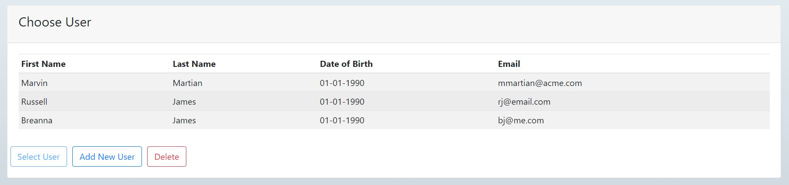

Calorie tracker app. Made by Russell James and Lydia Brynmoor for OSU project.
Node.js, express, bootstrap, handlebars, mysql.
This is a basic crud app that connects to a mysql database.  
<a href="http://208.113.132.24:3000/" target="_blank">Demo</a>  
Ability to add data to user table, food table, exercise table, and log tables. 
Data from tables is displayed.

